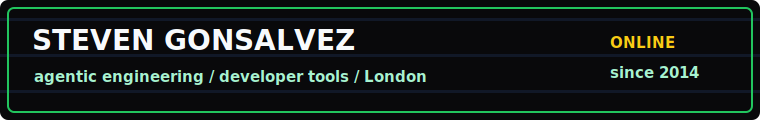
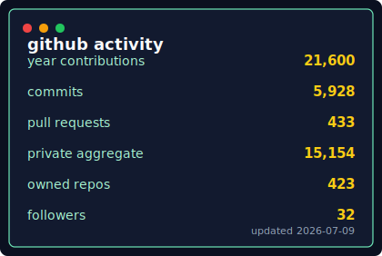
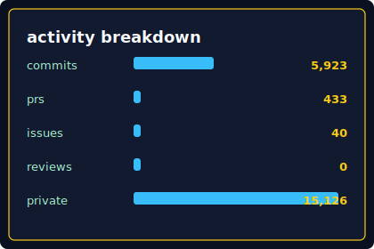

# Hi, I'm Steven

<p align="center">
  
</p>

London-based builder focused on agentic engineering, developer tools, and
shipping practical systems that make coding agents less fragile.

[](https://stevengonsalvez.com)
[](https://github.com/stevengonsalvez)
[](https://github.com/stevengonsalvez/agents-in-a-box)


## Start Here

- **[agents-in-a-box](https://github.com/stevengonsalvez/agents-in-a-box)** -
  context engineering for agentic coding.
- **[ainb-reflect-memory](https://github.com/stevengonsalvez/ainb-reflect-memory)** -
  long-term memory for AI coding agents.
- **[cerebro](https://github.com/stevengonsalvez/cerebro)** -
  local-first, token-minimal daily tech-intelligence pipeline.
- **[qstatus](https://github.com/stevengonsalvez/qstatus)** -
  Amazon Q Developer usage monitoring for macOS and CLI.
- **[promptregistry-mcp](https://github.com/stevengonsalvez/promptregistry-mcp)** -
  lightweight file-based prompt server for developers.
- **[stevengonsalvez.com](https://stevengonsalvez.com)** -
  writing on agents, automation, security, and practical software delivery.

## GitHub Activity

<p>
  
  
</p>

Private and restricted contribution totals are shown only as aggregates. Repo
names and private work details stay private.

## What I'm Building Around

- Agent workspaces that keep context, rules, memories, and tools close to code.
- Retrieval and recall systems that let coding agents learn without leaking scope.
- Small CLIs and dashboards that turn invisible developer workflow state into
  something inspectable.
- Writing that compresses hard-won workflow lessons into practical notes.

## Latest Writing

- [Token Optimisation Playbook](https://stevengonsalvez.com/blog/token-optimisation-playbook)
- [Opus vs GPT on Real Ops, Part 2](https://stevengonsalvez.com/blog/opus-vs-gpt-on-real-ops-part-2)
- [The Underappreciation and Rebirth of Warp](https://stevengonsalvez.com/blog/warp-rebirth)
- [Opus vs GPT on Real Ops](https://stevengonsalvez.com/blog/opus-vs-gpt-on-real-ops)
- [2-2 Factor for AI Agents](https://stevengonsalvez.com/blog/two-two-factor-for-agents)

## Connect

[](https://stevengonsalvez.com)
[](https://github.com/stevengonsalvez)

<details>
<summary>tiny retro status panel</summary>

```text
profile.exe       online
mode              agentic engineering
preferred loop    observe -> automate -> ship -> write it down
```

</details>
