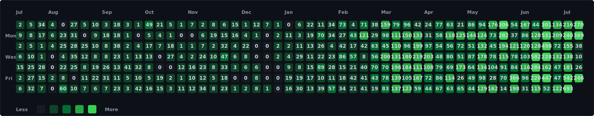

# Hi, I'm Steven 👋

📍 **London** | 🤖 **Agentic engineering builder** | 🛠️ **Developer tooling + ops systems**

I build practical tools for coding with agents: context engineering, long-term memory, workflow telemetry, and small CLIs that remove daily drag.

## Read Here

- ✍️ **[stevengonsalvez.com](https://stevengonsalvez.com)** - writing on agents, automation, security, and practical software delivery
- 📝 **[dev.to/stevengonsalvez](https://dev.to/stevengonsalvez)** - syndicated posts with canonical links back to the blog

## GitHub Activity

<!-- PROFILE-STATS:START -->
- 21,602 year contributions / 5,930 commits / 433 pull requests / 15,154 private aggregate / 423 owned repos / 32 followers
<!-- PROFILE-STATS:END -->

## Start Here

- 📦 **[agents-in-a-box](https://github.com/stevengonsalvez/agents-in-a-box)** - context engineering for agentic coding
- 🧠 **[ainb-reflect-memory](https://github.com/stevengonsalvez/ainb-reflect-memory)** - long-term memory for AI coding agents
- 🧰 **[ainb-toolkit](https://github.com/stevengonsalvez/ainb-toolkit)** - curated AI coding skills and per-tool rule sets
- 🛰️ **[cerebro](https://github.com/stevengonsalvez/cerebro)** - local-first, token-minimal daily tech-intelligence pipeline
- 📊 **[qstatus](https://github.com/stevengonsalvez/qstatus)** - Amazon Q Developer usage monitoring for macOS and CLI
- 🗂️ **[promptregistry-mcp](https://github.com/stevengonsalvez/promptregistry-mcp)** - lightweight file-based prompt server for developers

## Current Projects

### Agentic Engineering Core

- 📦 **[agents-in-a-box](https://github.com/stevengonsalvez/agents-in-a-box)** - context engineering for agentic coding
- 🧰 **[ainb-toolkit](https://github.com/stevengonsalvez/ainb-toolkit)** - portable skills, rules, and agent tooling for ainb
- 🧠 **[ainb-reflect-memory](https://github.com/stevengonsalvez/ainb-reflect-memory)** - GraphRAG + hybrid recall for coding agents
- 🔁 **[reflect-kb](https://github.com/stevengonsalvez/reflect-kb)** - archived cross-harness retrieval and learning KB
- 🧪 **[LLM-dojo](https://github.com/stevengonsalvez/LLM-dojo)** - byte-sized learning experiments for LLM workflows
- 🧬 **[nanoclaw-standalone](https://github.com/stevengonsalvez/nanoclaw-standalone)** - native runner mode for NanoClaw-style agents

### Agent Runtime, Prompts & MCP

- 🗂️ **[promptregistry-mcp](https://github.com/stevengonsalvez/promptregistry-mcp)** - file-based prompt server for developers
- 🌉 **[agent-bridge](https://github.com/stevengonsalvez/agent-bridge)** - TypeScript bridge work for agent integrations
- 🧩 **[mcp-ethicalhacks](https://github.com/stevengonsalvez/mcp-ethicalhacks)** - examples of how MCP compromises can happen
- ✅ **[todoist-mcp](https://github.com/stevengonsalvez/todoist-mcp)** - Todoist MCP server
- 🧰 **[claude-in-a-box](https://github.com/stevengonsalvez/claude-in-a-box)** - early boxed agent runtime experiments
- 🛠️ **[claude-debugger](https://github.com/stevengonsalvez/claude-debugger)** - debugging support repo

### Observability, Usage & Ops

- 📊 **[qstatus](https://github.com/stevengonsalvez/qstatus)** - real-time Amazon Q Developer usage monitoring
- 🍺 **[homebrew-qstatus](https://github.com/stevengonsalvez/homebrew-qstatus)** - Homebrew tap for QStatus
- 🍺 **[homebrew-agents-in-a-box](https://github.com/stevengonsalvez/homebrew-agents-in-a-box)** - auto-updated Homebrew tap for ainb
- 🧭 **[cerebro](https://github.com/stevengonsalvez/cerebro)** - tech-intelligence pipeline with local-first secrets discipline
- 🧪 **[patchmycode](https://github.com/stevengonsalvez/patchmycode)** - GitHub app experiment for fixing issues automatically
- 🕵️ **[autotronic-tester](https://github.com/stevengonsalvez/autotronic-tester)** - Python testing experiment

### Cloud, CI & Platform Experiments

- ☁️ **[cloud-cicd-exploration](https://github.com/stevengonsalvez/cloud-cicd-exploration)** - GitHub Actions and cloud CI experiments
- 📈 **[github-actions-newrelic](https://github.com/stevengonsalvez/github-actions-newrelic)** - GitHub Actions metrics to New Relic
- 🐳 **[docker-knife](https://github.com/stevengonsalvez/docker-knife)** - debugging container
- 🐳 **[docker-docsify](https://github.com/stevengonsalvez/docker-docsify)** - docsify Docker image
- 🧱 **[terraform-playground](https://github.com/stevengonsalvez/terraform-playground)** - Terraform experiments
- 📦 **[terraform-azurerm-container-apps](https://github.com/stevengonsalvez/terraform-azurerm-container-apps)** - Azure Container Apps Terraform module

### Apps, Demos & Learning

- 🧑‍🏫 **[devtalk-ai-intro](https://github.com/stevengonsalvez/devtalk-ai-intro)** - Vue AI intro material
- 🧱 **[royal-mail-storybook](https://github.com/stevengonsalvez/royal-mail-storybook)** - Storybook component library work
- 🧮 **[graphql-lazyloading-example](https://github.com/stevengonsalvez/graphql-lazyloading-example)** - GraphQL lazy-loading example
- 🧪 **[ccproxykiro](https://github.com/stevengonsalvez/ccproxykiro)** - Anthropic API proxy to AWS CodeWhisperer using Kiro auth
- 📚 **[python_training](https://github.com/stevengonsalvez/python_training)** - Python training material
- 📝 **[bytesizedbanter](https://github.com/stevengonsalvez/bytesizedbanter)** - blog publishing repo

### Personal Infrastructure

- ⚙️ **[dotfiles](https://github.com/stevengonsalvez/dotfiles)** - dotfiles
- 🧾 **[stevengonsalvez](https://github.com/stevengonsalvez/stevengonsalvez)** - this profile README
- 🧑‍🎨 **[ian-illustrations-port](https://github.com/stevengonsalvez/ian-illustrations-port)** - English port of hand-drawn Blot illustration skill
- 🧱 **[styleguides](https://github.com/stevengonsalvez/styleguides)** - coding standards and guidelines archive

## What I'm Doing

- **Building agent workspaces** - Keeping prompts, skills, memories, telemetry, and code close enough to survive real work
- **Compressing agent cost** - Measuring token waste, trimming context, and routing judgment to the right model
- **Writing about AI workflows** - Publishing practical notes on [stevengonsalvez.com](https://stevengonsalvez.com)
- **Turning workflow pain into tools** - Small CLIs, dashboards, and repo conventions before big platforms

## Latest Blog Posts

<!-- BLOG-POST-LIST:START -->
- [The Token Optimisation Playbook](https://stevengonsalvez.com/blog/token-optimisation-playbook)
- [Opus vs GPT on Real Ops, Part 2](https://stevengonsalvez.com/blog/opus-vs-gpt-on-real-ops-part-2)
- [The Underappreciation and Rebirth of Warp](https://stevengonsalvez.com/blog/warp-rebirth)
- [Opus vs GPT on Real Ops: Same Brain Food, Different Brains](https://stevengonsalvez.com/blog/opus-vs-gpt-on-real-ops)
- [2-2 Factor for AI Agents: Multi-Agent Reliability](https://stevengonsalvez.com/blog/two-two-factor-for-agents)
<!-- BLOG-POST-LIST:END -->

## Connect

---

### Recognition

- 21k+ GitHub contributions in the last year
- 423 owned repositories across agent tooling, platform experiments, CI, cloud, and learning projects
- Maintainer of **[agents-in-a-box](https://github.com/stevengonsalvez/agents-in-a-box)**, **[ainb-toolkit](https://github.com/stevengonsalvez/ainb-toolkit)**, and **[ainb-reflect-memory](https://github.com/stevengonsalvez/ainb-reflect-memory)**
- Writing and tooling used as working notes for agentic engineering systems

### Philosophy

> Ship the smallest useful loop, measure where it breaks, then encode the lesson so the next agent run starts smarter.

Random Facts

- I like tools that make hidden workflow state visible.
- I prefer local-first systems until the network earns its place.
- I write docs because future me has terrible memory.
- I care more about reliable loops than fancy demos.

